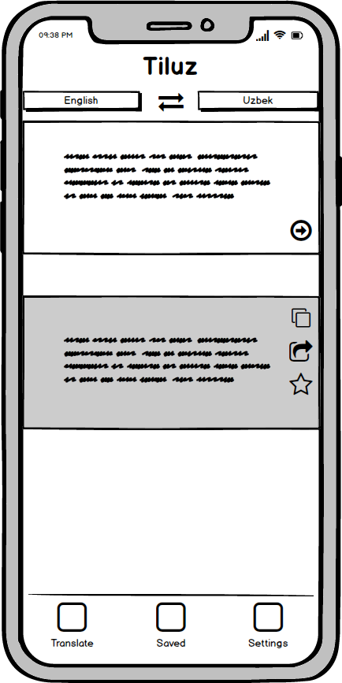
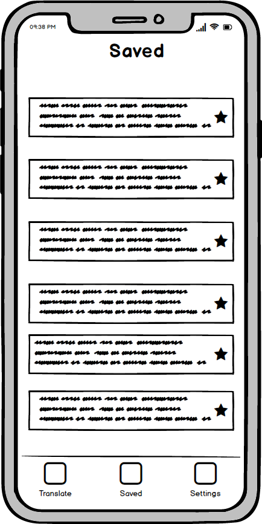
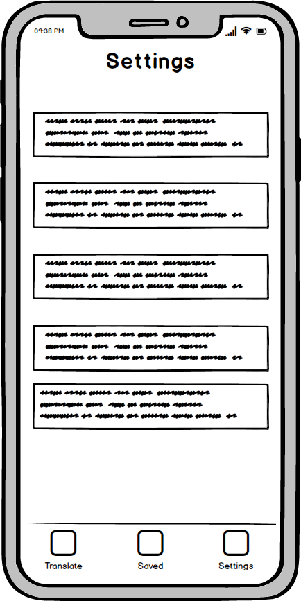

# SFSU CSC 690 - iOS course final project

- App name: **iTiluz**
- Author: Jakhongir Khusanov.
- Reviewer: [@Yordina](https://github.com/yordina)

English - Uzbek language translator & learner. The app UI will be based on my own transliteration app called [Tiluz](https://github.com/jkhusanov/tiluz) created with React Native. This new native iOS app will be logical continuation of my original plan where I've wanted to create all in one platform for people who want to advance both their native and foreign language skills.

## Milestone 1: Proposal (04/11/2019)

### Must-have features

- [x] Online English - Uzbek & Uzbek - English translator. Home tab (8 hrs)
- [x] Copy translation to clipboard. Home tab (1 hr)
- [x] Share translation. Home tab (1 hr)
- [x] Save translation. Home tab (5 hrs)
- [x] Saved translations list screen. Saved tab (5 hr)

### Nice-to-have features

- [ ] Make localization in English and Uzbek (5 hrs)
- [ ] Firebase database of basic words setup for language learning (20)
- [ ] Learn / practice saved translations (12 hrs)
- [ ] Simple game to make learning fun (15 hrs)
- [x] Some settings tab with basic settings and general app information (2 hrs)

### Wireframes

|                                                    |                                                |                                                   |
| :------------------------------------------------: | :--------------------------------------------: | :-----------------------------------------------: |
|  |  |  |
