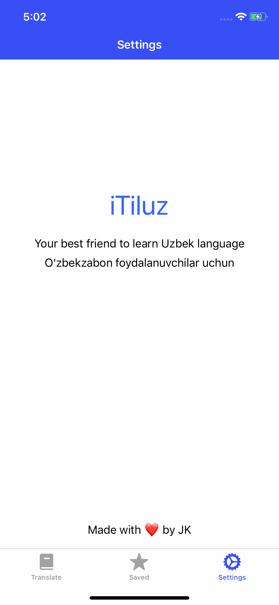

# SFSU CSC 690 - iOS course final project

- App name: **iTiluz**
- Author: Jakhongir Khusanov.
- Reviewer: [@Yordina](https://github.com/yordina)

English - Uzbek language translator & learner. The app UI will be based on my own transliteration app called [Tiluz](https://github.com/jkhusanov/tiluz) created with React Native. This new native iOS app will be logical continuation of my original plan where I've wanted to create all in one platform for people who want to advance both their native and foreign language skills.

<p align="center">
  <a href="https://github.com/csc-690-sfsu/spring19-final-project">
    
  </a>
</p>

<h3 align="center">
  iTiluz
</h3>

<p align="center">
  Translator app
</p>

## Preview


|                                             |                                             |                                             |
| :-----------------------------------------: | :-----------------------------------------: | :-----------------------------------------: |
|  |  |  |
|  |  |  |  |

## Getting started

**For the full and better experience use real device**

```
git clone https://github.com/csc-690-sfsu/spring19-final-project

cd iTiluz

xed .
```

## Things learned

This project helped me dive into Swift development and get my ideas into real life. I was able to compare Swift with React Native, I really liked how it provides simple yet powerful features out of the box. As I mentioned earlier I have experience with React Native and an app called Tiluz on app stores. I wanted to add more features to the app, and this project helps me to get started with those new features. Although the saved screen is not perfect, I'm really proud of my translator screen. It has 100% of what I wanted initially. I'll definitely keep working on this app and publish a new version of Tiluz soon.

## Milestone 1: Proposal (04/11/2019)

### Must-have features

- [x] Online English - Uzbek & Uzbek - English translator. Home tab (8 hrs)
- [x] Copy translation to clipboard. Home tab (1 hr)
- [x] Share translation. Home tab (1 hr)
- [x] Save translation. Home tab (5 hrs)
- [x] Saved translations list screen. Saved tab (5 hr)

### Nice-to-have features

- [ ] Make localization in English and Uzbek (5 hrs)
- [ ] Firebase database of basic words setup for language learning (20)
- [ ] Learn / practice saved translations (12 hrs)
- [ ] Simple game to make learning fun (15 hrs)
- [x] Some settings tab with basic settings and general app information (2 hrs)

### Wireframes

|                                                    |                                                |                                                   |
| :------------------------------------------------: | :--------------------------------------------: | :-----------------------------------------------: |
|  |  |  |
